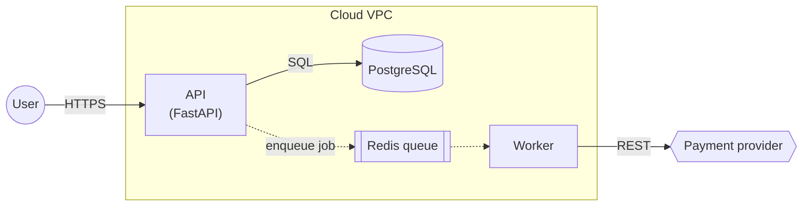

# System-Design Diagram (Mermaid)

## Steps
1. Ground it: read the code / config / design doc first. Every node and edge must map to something real (a module, service, table, queue, external API). Do not invent components; mark guesses as `?` in the label and say so.
2. Pick one question the diagram answers, then the type:

   | Question | Mermaid type |
   |---|---|
   | What talks to what (system context / containers) | `flowchart LR` + `subgraph` per boundary |
   | What happens on one request, in order | `sequenceDiagram` |
   | What the data model looks like | `erDiagram` |
   | Lifecycle of one entity / job | `stateDiagram-v2` |
   | Where things run (hosts, clusters, regions) | `flowchart TB` + nested `subgraph` |

   One diagram per question. Split instead of cramming (> ~15 nodes or crossing edges everywhere).
3. Write it with the conventions below.
4. Validate if possible: `npx -y @mermaid-js/mermaid-cli -i diagram.mmd -o diagram.svg`. Fix any parse error before handing it over.
5. Output the fenced ```` ```mermaid ```` block plus 2–4 bullets explaining the non-obvious edges. In a repo, put it where it is read (README / `docs/`), not a new file nobody links to.

## Conventions (GitHub-renderable)
- IDs: short camelCase (`apiGw`, `orderSvc`); human text goes in labels: `orderSvc["Order Service<br/>(FastAPI)"]`.
- Always quote labels containing spaces, parentheses, slashes or `:`.
- Shapes: service `[ ]`, datastore `[( )]`, queue/topic `[[ ]]`, external system `{{ }}`, user `(( ))`.
- Label edges with the verb + protocol: `-->|"REST /orders"|`, `-.->|"async: order.created"|` (dotted = async).
- `subgraph` = trust / deployment boundary (VPC, cluster, third party); title it.
- Sequence diagrams: `autonumber`; `->>` sync call, `-->>` reply, `-)` async; use `alt` / `opt` / `loop` for branches, `Note over` for invariants.
- No styling / theme / `classDef` unless asked; avoid experimental `C4Context` (renders inconsistently on GitHub).

## Example

